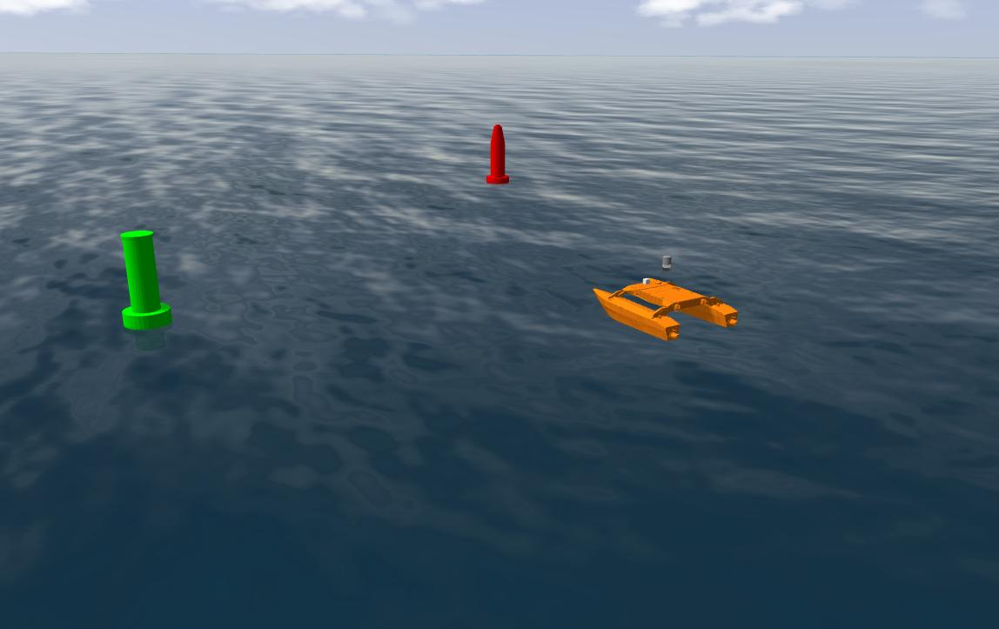
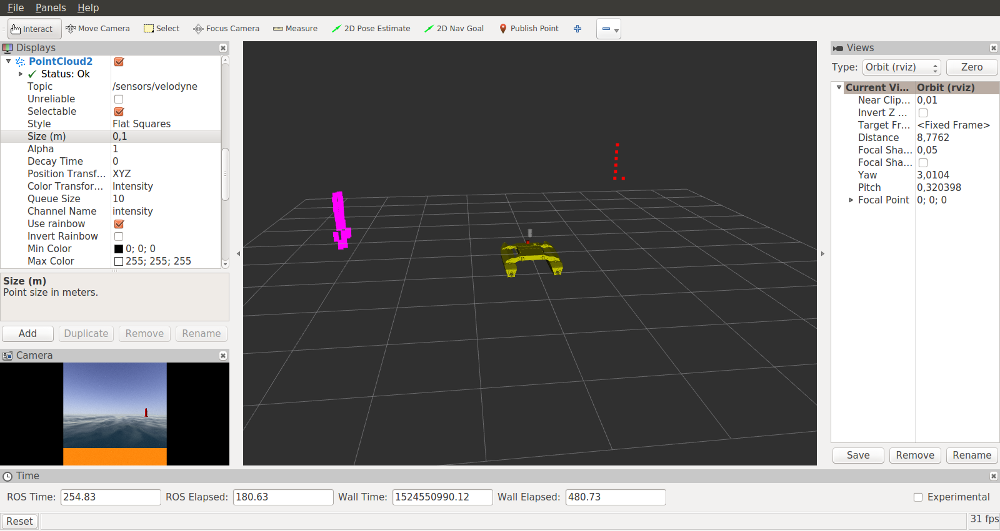

# Kingfisher URDF description

## Overview

THis package provides a ROS URDF description of Clearpath's Kingfisher robot.

It implements additionnal sensors that interface with Gazebo.

## Structure

The main definitions are located in the URDF folder. In hierarchical order:
- `kingfisher_robotx.xacro` is the entry files, which import the orther file
- `standard.urdf.xacro` adds an additionnal link for the sonar
- `base.urdf.xacro` defines the robot physical frame
- `parts.urdf.xacro` defines the pontoon link
- `materials.urdf.xacro` defines the colors
- `sensor_*.xacro` define sensors plugins for Gazebo

## Known issues

In wavy environnements, Kingfisher model can react weirdly to big amplitude waves. For example, temporary :
- flying robot 
- sinking robot

That is caused by the ocean shader not following the altitude of the simulated waves.

Be careful of that when analysing designing image analysis softwares.

## Visuals

Gazebo simulation in open ocean world:

Data visualisation in RViz:

